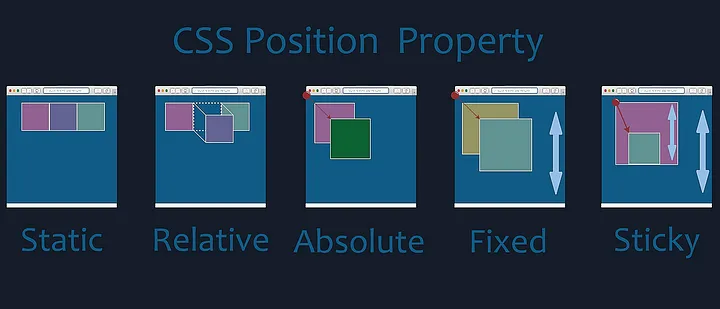

# 🌍 Comprendre les Types de Positionnement en CSS

Le **positionnement** en CSS est essentiel pour contrôler l'agencement des éléments sur une page web. Voici un guide complet sur les différents types de positionnement en CSS : `static`, `relative`, `absolute`, `fixed`, et `sticky`. 

## 📚 Sommaire

1. [Position `static`](#static)
2. [Position `relative`](#relative)
3. [Position `absolute`](#absolute)
4. [Position `fixed`](#fixed)
5. [Position `sticky`](#sticky)
6. [Récapitulatif visuel](#récapitulatif-visuel)

---

## 1️⃣ **`static`** (Par défaut)

**Comportement** :  
L'élément est positionné selon le flux normal du document. C'est la valeur par défaut de la propriété `position`. Les propriétés comme `top`, `left`, `right`, et `bottom` n'ont aucun effet sur un élément `static`.

```css
div {
    position: static;
}
```

**Particularité** :  
L'élément reste dans le flux de la page et se place où il apparaît dans le code HTML, sans être déplacé.

---

## 2️⃣ **`relative`**

**Comportement** :  
L'élément est positionné par rapport à sa position d'origine dans le flux du document. Il reste dans le flux mais peut être déplacé par rapport à sa position initiale avec `top`, `left`, `bottom`, ou `right`.

```css
div {
    position: relative;
    top: 20px;
    left: 50px;
}
```

**Particularité** :  
L'élément conserve son espace dans le flux, mais son positionnement peut être modifié par rapport à sa position originale.

---

## 3️⃣ **`absolute`**

**Comportement** :  
L'élément est positionné par rapport à son parent le plus proche qui n'a pas de `position: static` (souvent un parent avec `position: relative`). Si aucun parent n'a de positionnement défini, l'élément est positionné par rapport à la fenêtre (l'élément `<html>`).

```css
div {
    position: absolute;
    top: 50px;
    left: 100px;
}
```

**Particularité** :  
L'élément est retiré du flux normal de la page, ce qui signifie qu'il ne prend plus de place dans le flux du document. Il est déplacé selon les propriétés `top`, `left`, `bottom`, et `right` par rapport à son parent le plus proche.

---

## 4️⃣ **`fixed`**

**Comportement** :  
L'élément est positionné par rapport à la fenêtre du navigateur (et non par rapport à son parent). Il reste **fixe**, même lors du défilement de la page.

```css
div {
    position: fixed;
    top: 0;
    right: 0;
}
```

**Particularité** :  
L'élément reste à la même position, même si l'utilisateur fait défiler la page.

---

## 5️⃣ **`sticky`**

**Comportement** :  
L'élément se comporte comme un élément `relative` jusqu'à ce qu'il atteigne une position donnée dans la fenêtre du navigateur( pixel 0), après quoi il devient "collant" et reste fixé.

```css
div {
    position: sticky;
    top: 0;
}
```

**Particularité** :  
L'élément devient fixe seulement lorsqu'il atteint une position déterminée (par exemple, `top: 0`).

---
## 🔥 Récapitulatif visuel des positions CSS

| **Positionnement** | **Comportement**  | **Exemple CSS**                      |
|--------------------|----------------------------------------------------------------------------------------------------|--------------------------------------|
| **`static`**        | Positionnement selon le flux normal du document. Pas d'effet des propriétés `top`, `left`, etc.     | `position: static;`                  |
| **`relative`**      | Positionné par rapport à sa position initiale dans le flux. Peut être déplacé avec `top`, `left`.  | `position: relative; top: 20px;`     |
| **`absolute`**      | Positionné par rapport à son parent (ou la fenêtre si aucun parent positionné).                    | `position: absolute; top: 50px;`     |
| **`fixed`**         | Positionné par rapport à la fenêtre du navigateur. Reste fixe même lors du défilement de la page.   | `position: fixed; top: 0;`           |
| **`sticky`**        | Se comporte comme `relative` jusqu'à atteindre une position donnée, puis reste fixe à cet endroit. | `position: sticky; top: 0;`          |

---
### Image illutration

